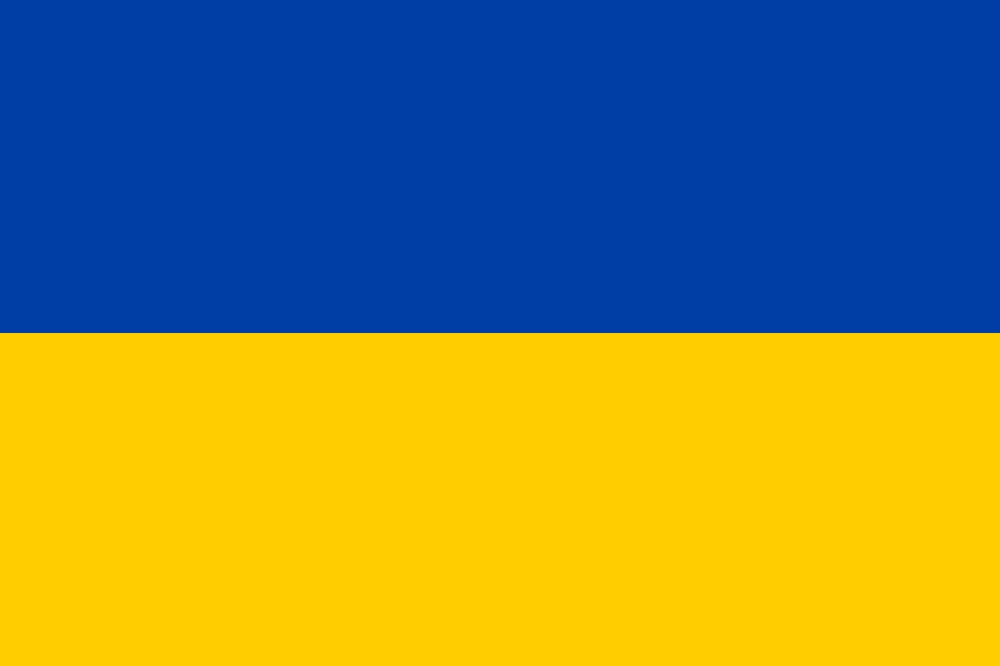

---

    
  <strong>Українською</strong>    

    
  <a href="README.md">Switch to English</a>    

---

<h1 align="center">Олег Погорелов - .NET Розробник</h1>

    

---

### 📩 Контакти  

  
  
  

  

  

---

#### Про мене

.NET-розробник із 3-річним досвідом у проєктуванні та розробці веб-застосунків на базі ASP.NET Core, Entity Framework Core та MSSQL Server. Успішно автоматизував бізнес-процеси, зменшуючи час і кількість помилок у виробничому середовищі.

---

### 🔧 Технологічний стек  

  
  
  
  
  
  
  
  
  

---

#### НАВИЧКИ ТА ТЕХНОЛОГІЇ

- **Back-end:** C#, ASP.NET Core (MVC, REST), Entity Framework, LINQ  
- **Доставка та DevOps:** CI/CD, Docker, WiX Toolset (MSI інсталятори), Azure DevOps, Web Deploy  
- **Бази даних:** MSSQL, MySQL/MariaDB, PostgreSQL  
- **Frontend / Клієнт:** Blazor Server, MAUI Hybrid (базовий рівень), HTML, JS, CSS  
- **Інше:** Git/GitHub, Postman, Stripe, PayPal  
- **Мови:** Англійська — Середній (B1), Українська — Рідна  

---

### 🛠️ ТЕХНІЧНИЙ ДОСВІД

---

#### **IntenseLab** 📅 **01.2025 – дотепер**
#### **Fintech – Платформа ринкових даних та онлайн-брокериджу**  
Працював над **.NET MAUI десктопним застосунком** для аналітики торгів у реальному часі та моніторингу.  
Підтримував і модернізував **WPF-компоненти**, створив **Wix v6 інсталятор** та апдейтер з для автоматизації розгортання.  
Розробляв **Blazor Server/WASM** дашборди для візуалізації ринкових даних.  
Брав участь у налаштуванні **CI/CD пайплайнів у Microsoft Azure DevOps** та **розгортанні .NET сервісів на Linux**.  
Інтегрував **Kafka** та **PostgreSQL** для потокової обробки даних у реальному часі та їх збереження.  
**Технології:** .NET 8, MAUI, WPF, Blazor, PostgreSQL, Kafka, Azure DevOps, Linux, Wix v6

---

#### **Freelance – .NET Developer (Контракт)** 📅 **01.2025 – 03.2025**
#### **English Global Express (EdTech)** | Опис проєкту  
Розробив RESTful backend API для управління онлайн-уроками англійської мови, студентами, викладачами та завданнями. Реалізував JWT-аутентифікацію з використанням ASP.NET Core Identity та інтегрував завантаження файлів для домашніх завдань. Створив чисту архітектуру з чітким розділенням DTO, Entity та Controller для масштабованості та зручності підтримки.  
**Технології:** ASP.NET Core 8 Web API, Entity Framework Core, MSSQL, Identity, JWT Authentication, AutoMapper, FluentValidation

---

#### ТОВ "КРИВООЗЕРСЬКА" 📅 **02.2023 – 12.2024**

#### **1. B2B-платформа для замовлень дистриб'юторів KStore** | [Опис проєкту](projects/b2b-krivoozerska/summary_ua.md)
Веб-платформа, створена для автоматизації обробки замовлень дистриб'юторів. До її впровадження замовлення отримували через електронну пошту у вигляді окремих файлів, що вимагало ручного введення в ERP-систему. Скорочено час обробки замовлень з 8 годин на тиждень до 10 хвилин на день — економія понад 300 годин на рік.

- Спрощено процес створення та відстеження замовлень.
- Реалізовано персоналізовані прайс-листи, історію замовлень, внутрішню систему повідомлень та сповіщень.
- Додано можливість експорту в .csv для подальшого імпорту в ERP-систему.
- Реалізовано погодження документів з партнерами. Генерація QR коду на документі з даними про дату, підписанта тощо

**Технології:** ASP.NET Core, Entity Framework Core, MSSQL, REST API, Microsoft Graph API (сповіщення на email)

---

#### **2. Система управління обліком торгового обладнання KretailPro** | [Опис проєкту](projects/kretailpro/summary_ua.md)
Система обліку торгового обладнання, що замінила використання Excel-таблиць і забезпечила автоматизований контроль розміщення холодильників та полиць.
Інвентаризація стала прозорою — кожен пристрій має QR-код, фото і відображається на карті

- Реалізовано ієрархічну структуру обліку обладнання за регіонами, районами та населеними пунктами.
- Інтегровано Google Maps API для відображення місцезнаходження обладнання та відстеження перевірок.
- Додано QR-коди для швидкого доступу до інформації про обладнання.
- Реалізовано експорт звітів у форматі .xlsx та аналітику за наявністю фото та геолокації.

**Технології:** ASP.NET Core, Entity Framework Core, MSSQL, REST API, Google Maps API, Microsoft Graph API (сповіщення на email)

---

#### **3. B2B-платформа для замовлення продукції пекарні "Кривоозерська"** | [Опис проєкту](projects/b2b-krivoozerska-bakery/summary_ua.md) | [Демо-версія кабінету замовлень](https://krpk.net/Demo/Client/Main) | [Веб-сайт пекарні](https://bakery.krpk.net)  
Платформа для замовлення хлібобулочних виробів, що оптимізувала процес обробки клієнтських замовлень. До 10% клієнтів перейшли на самообслуговування через платформу, зменшивши навантаження на кол-центр.

- Розроблено зручний каталог продукції з можливістю фільтрації та сортування.
- Реалізовано історію замовлень, функцію повторного замовлення, систему знижок, індивідуальні прайс-листи та систему обробки повернень.
- Інтегровано з ERP-системою через експорт замовлень у файл для подальшого імпорту.
- Реалізовано email-сповіщення клієнтів щодо оновлення статусу замовлення.

**Технології:** ASP.NET Core, Entity Framework Core, MSSQL, REST API, Bootstrap, JavaScript

---

#### **4. Krivoozerska Pallet Mark - WPF-десктопний додаток** | [Опис проєкту](projects/krivoozerska-pallet-mark/summary_ua.md)  
WPF-застосунок для автоматизації маркування піддонів у виробництві мінеральної води, що замінив ручне заповнення паперових етикеток/ярликів.
Усунено ручне заповнення понад 100 ярликів щодня — зменшено помилки і втрати під час транспортування.

- Поля введення поділяються на **дві категорії**:
  - **Дані для етикетки (друкуються на Xprinter XP-480B термопринтері)**: Бренд, Продукт, Дата виготовлення, Партія, Кількість пляшок, Розташування в ряду/на піддоні, Вага (кг).
  - **Дані для штрихкоду (кодуються для відстеження)**: Тип води, Майстер, Лінія, Зміна, Робочий період.
- Надає **попередній перегляд етикетки** у реальному часі перед друком.
- Підтримує **масовий друк** для підвищення ефективності.

**Технології:** WPF (.NET 9), XAML, C#, Xprinter Thermal Printer(XP-480B), Генерація штрихкодів  

---

#### **5. Офіційний сайт ТМ "Кривоозерська"** | [Опис проєкту](projects/krivoozerska-ua/summary_ua.md) | [Переглянути веб-сайт](https://krivoozerska.hsf.company)
Сучасний та візуально привабливий **веб-сайт на ASP.NET Core** для бренду **Кривоозерська**, створений для підвищення впізнаваності бренду та взаємодії з клієнтами.

- **Динамічне управління контентом**, побудоване на **ASP.NET Core та Entity Framework Core**.  
- **Автоматизовані email-сповіщення** через **Microsoft Graph API** для запитів і зв’язку з партнерами.  
- **Каталог продукції та сторінки компанії** зі структурованою навігацією.  
- **Адаптивний дизайн**, що забезпечує плавну роботу на будь-яких пристроях.  
- **База даних MSSQL**, що містить інформацію про продукцію, новини та запити партнерів.  
- **Форма зворотного зв’язку** з можливістю швидкого дзвінка та відправки електронного листа.

**Технології:** ASP.NET Core, Entity Framework Core, MSSQL, Microsoft Graph API, Decentralization Gov API, Adobe PDF Embed API, Bootstrap, JavaScript  

---

### 🧩 Нетехнічний досвід

До повноцінного переходу в .NET-розробку я працював у компанії **ТОВ "Кривоозерська ХСФ"**, яка охоплює виробництво мінеральної води, пекарню, дистрибуцію та власну мережу магазинів.

- **Системний адміністратор**: налаштування локальних мереж, касового обладнання, інтеграція ПЗ, підтримка офісної техніки.
- **Стажування у всіх напрямках бізнесу**: виробництво, дистрибуція, логістика, рітейл — для повного розуміння структури компанії.
- **Асистент комерційного директора**: аналітика продажів, участь у розробці мотиваційних систем, взаємодія з регіональними менеджерами.
- **Маркетинг і PR**: розвиток TikTok та Instagram бренду, зйомка відео, організація промо-активностей.
- **Інтеграція зовнішніх сервісів**: налаштування та запуск систем **Spot2D** і **Spot2R** від компанії **PraData** — для моніторингу присутності продукції в торгових точках і контролю активностей.
- **Ініціатор .NET-рішень**: розробка внутрішніх рішень для оптимізації бізнес-процесів.

Цей досвід сформував розуміння бізнес-процесів зсередини, що допомагає мені створювати більш ефективні .NET-рішення.

---

#### ОСВІТА

🎓 **Бакалавр з прикладної механіки** *(2021 – 2024)*  
📍 *Первомайський навчально-науковий інститут Національного університету кораблебудування ім. адмірала Макарова*  

🎓 **Молодший спеціаліст з комп'ютерної інженерії** *(2017 – 2021)*  
📍 *Первомайський фаховий коледж Національного університету кораблебудування ім. адмірала Макарова*  

---

 - 💼 [LinkedIn](https://www.linkedin.com/in/pohorelov-oleh/)  
 - ✈️ [Telegram](https://t.me/pohorelov_oe)
 - 📩 pohorelov.oe@gmail.com  
 - 📱 +38 (097) 094 86 78

---
