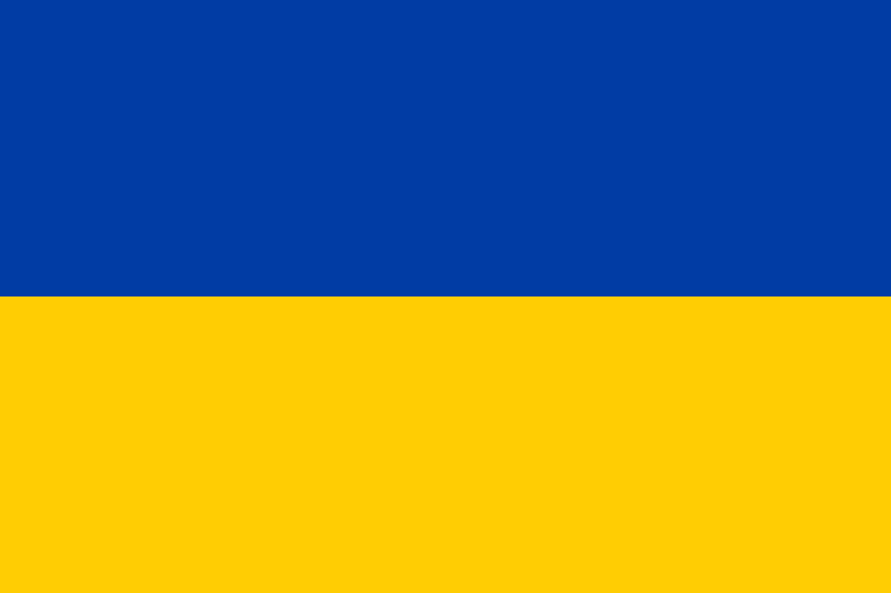

---

    
  <strong>Українською</strong>    

    
  <a href="README.md">Switch to English</a>    

---

<h1 align="center">Олег Погорєлов - .NET Розробник</h1>

    

---

### 📩 Контакти  

  
  
  

  

  

---

#### Про мене

.NET-розробник із 1,5-річним досвідом у проєктуванні та розробці веб-застосунків на базі ASP.NET Core, Entity Framework Core та MSSQL Server. Успішно автоматизував бізнес-процеси, зменшуючи час і кількість помилок у виробничому середовищі.

---

### 🔧 Технологічний стек  

  
  
  
  
  
  
  
  
  

---

#### НАВИЧКИ ТА ТЕХНОЛОГІЇ

- **Розробка ПЗ:** C#, ASP.NET Core (MVC, REST API), MAUI (базовий рівень), Entity Framework Core, MSSQL (T-SQL, LINQ), Патерни проєктування, HTML, CSS, JavaScript  
- **Мови:** Англійська - Середній (B1), Українська - Рідна  
- **DevOps & Інструменти:** Git, GitHub, Azure (базовий рівень)  
- **Системне адміністрування:** Windows Server 2022, Локальні мережі  
- **Інструменти:** Visual Studio, Microsoft Office (Word, Excel, PowerPoint), Figma, Canva  
- **Soft Skills:** Вирішення проблем, Робота в команді, Адаптивність  

---

### ТЕХНІЧНИЙ ДОСВІД

#### ТОВ "КРИВООЗЕРСЬКА" 📅 **10.2021 – 12.2024**

#### **1. B2B-платформа для замовлень дистриб'юторів** | [Огляд проєкту](projects/krivoozerska-ua/summary_ua.md)
Веб-платформа, створена для автоматизації обробки замовлень дистриб'юторів. До її впровадження замовлення отримували через електронну пошту у вигляді окремих файлів, що вимагало ручного введення в ERP-систему.

- Спрощено процес створення та відстеження замовлень.
- Реалізовано персоналізовані прайс-листи, історію замовлень, внутрішню систему повідомлень та сповіщень.
- Додано можливість експорту в .csv для подальшого імпорту в ERP-систему.
- Реалізовано погодження документів з партнерами. Генерація QR коду на документі з даними про дату, підписанта тощо

**Технології:** ASP.NET Core, Entity Framework Core, MSSQL, REST API, Microsoft Graph API (сповіщення на email)

---

#### **2. Система управління обліком торгового обладнання** | [Огляд проєкту](projects/kretailpro/summary_ua.md)
Система обліку торгового обладнання, що замінила використання Excel-таблиць і забезпечила автоматизований контроль розміщення холодильників та полиць.

- Реалізовано ієрархічну структуру обліку обладнання за регіонами, районами та населеними пунктами.
- Інтегровано Google Maps API для відображення місцезнаходження обладнання та відстеження перевірок.
- Додано QR-коди для швидкого доступу до інформації про обладнання.
- Реалізовано експорт звітів у форматі .xlsx та аналітику за наявністю фото та геолокації.

**Технології:** ASP.NET Core, Entity Framework Core, MSSQL, REST API, Google Maps API, Microsoft Graph API (сповіщення на email)

---

#### **3. B2B-платформа для замовлення продукції Кривоозерської пекарні** | [Огляд проєкту](projects/b2b-krivoozerska-bakery/summary_ua.md)  
Платформа для замовлення хлібобулочних виробів, що оптимізувала процес обробки клієнтських замовлень.

- Розроблено зручний каталог продукції з можливістю фільтрації та сортування.
- Реалізовано історію замовлень, функцію повторного замовлення та систему обробки повернень.
- Інтегровано з ERP-системою через експорт замовлень у файл для подальшого імпорту.
- Реалізовано email-сповіщення клієнтів щодо оновлення статусу замовлення.
- Зменшено навантаження на операторів, але не повністю автоматизовано обробку замовлень.

**Технології:** ASP.NET Core, Entity Framework Core, MSSQL, REST API, Bootstrap, JavaScript

---

### **4. Krivoozerska Pallet Mark - WPF-десктопний додаток** | [Огляд проєкту](projects/krivoozerska-pallet-mark/summary_ua.md)  
WPF-застосунок для автоматизації маркування піддонів у виробництві мінеральної води, що замінив ручне заповнення паперових етикеток.

- Поля введення поділяються на **дві категорії**:
  - **Дані для етикетки (друкуються на Xprinter термопринтері)**: Бренд, Продукт, Дата виготовлення, Партія, Кількість пляшок, Розташування в ряду/на піддоні, Вага (кг).
  - **Дані для штрихкоду (кодуються для відстеження)**: Тип води, Майстер, Лінія, Зміна, Робочий період, Дата.
- Надає **попередній перегляд етикетки** у реальному часі перед друком.
- Підтримує **масовий друк** для підвищення ефективності.

**Технології:** WPF (.NET 9), XAML, C#, Xprinter Thermal Printer, Генерація штрихкодів  

---

### **5. Офіційний сайт Кривоозерська** | [Огляд проєкту](projects/krivoozerska-website/summary_ua.md)  
Сучасний та візуально привабливий **веб-сайт на ASP.NET Core** для бренду **Кривоозерська**, створений для підвищення впізнаваності бренду та взаємодії з клієнтами.

- **Динамічне управління контентом**, побудоване на **ASP.NET Core та Entity Framework Core**.  
- **Автоматизовані email-сповіщення** через **Microsoft Graph API** для запитів і зв’язку з партнерами.  
- **Каталог продукції та сторінки компанії** зі структурованою навігацією.  
- **Адаптивний дизайн**, що забезпечує плавну роботу на будь-яких пристроях.  
- **База даних MSSQL**, що містить інформацію про продукцію, новини та запити партнерів.  
- **Форма зворотного зв’язку** з можливістю швидкого дзвінка та відправки електронного листа.

**Технології:** ASP.NET Core, Entity Framework Core, MSSQL, Microsoft Graph API, Bootstrap, JavaScript  

---

#### ОСВІТА

🎓 **Бакалавр з прикладної механіки** *(2021 – 2024)*  
📍 *Первомайський навчально-науковий інститут Національного університету кораблебудування ім. адмірала Макарова*  

🎓 **Молодший спеціаліст з комп'ютерної інженерії** *(2017 – 2021)*  
📍 *Первомайський фаховий коледж Національного університету кораблебудування ім. адмірала Макарова*  

---

#### 🚀 Долучайся!
💼 [LinkedIn](https://www.linkedin.com/in/pohorelov-oleh/)  
📩 pohorelov.oe@gmail.com  
📱 +38 (097) 094 86 78  
📍 Криве Озеро, Україна  
