---

    
  <a href="summary_ua.md">Українською</a>

     
    <strong>Switch to English</strong>

  🏠<a href="https://github.com/pohorelov-oleh/portfolio">Main page</a>

---

# 📦 KStore – Distributor Order Portal

## 📌 General Information
- **Launch Date:** 02.2024  
- **Purpose:** Automation of order processing from distributors, internal messaging, order status tracking, document approval, and reporting.

### ⚙️ Technology Stack  
 - **Backend:** ASP.NET Core 6, Entity Framework Core 6, Microsoft SQL Server, Microsoft Graph API  
 - **Frontend:** HTML / CSS / JavaScript, DataTables, TinyMCE, Bootstrap
---

## 🚀 Project Overview

Before implementing **KStore**, manual processing of orders in the ERP system took an average of **8 hours per week**, totaling over **300 hours annually**.  
After launching the system, this time was reduced to **less than 10 minutes per day**, resulting in a **96% time savings**.

Previously, the order collection and processing workflow at **Kryvoozerska LLC** was inefficient and resource-intensive.  
Orders were received as individual files via email, and a manager had to manually enter them into the ERP system, selecting the counterparty, products, contract, warehouse, packaging, and other details.  
Due to the complexity of the process and lack of integration, delays, lost orders, data entry errors, and difficulties caused by limited internet access in the internal network were common.

The launch of **KStore** resolved these issues:
- 📥 Distributors can independently create orders and track past ones  
- 🧾 All orders are exported in `.csv` format for seamless ERP import  
- 🔄 Order processing time reduced by 98%, eliminating human error and data loss  
- 📬 Order status tracking and notifications implemented  
- 🌐 A convenient digital workspace was created for interaction with the manufacturer  

- **KStore** became a key step in business process digitalization, improving partner service and reducing operational costs.
---

## 📌 Key Functional Modules

### 1. Messaging
- Internal system for exchanging messages between distributors and the manufacturer  
- **Functionality:**  
  - Message subject, priority, attachments  
  - Rich text editor **TinyMCE**  
  - Filters: `"Received"`, `"Sent"`, `"New Message"`

📸 Show screenshots of the "Messaging" section

  
  
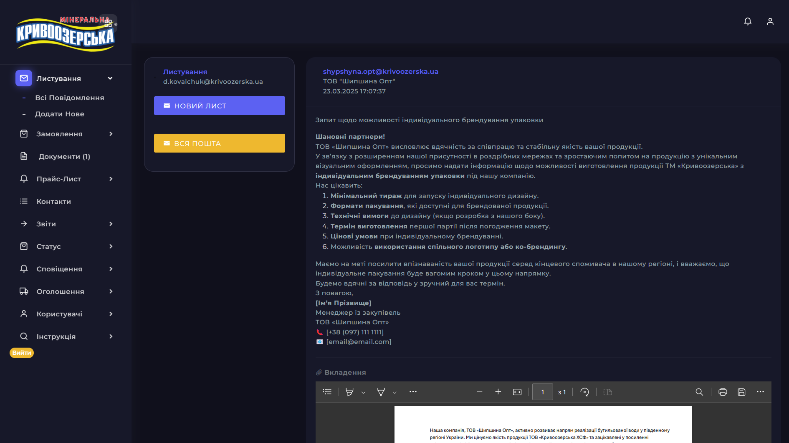

---

### 2. Orders
- Display and management of all orders  
- **Filters:** order number, date, distributor, city, status  
- **Statuses:** `"Completed"`, `"Rejected"`, `"In Progress"`  
- **Automatic notifications** via **Microsoft Graph API**  
- **Weight and pallet calculator** to control maximum load  

- Order saving is implemented using **Entity Framework Core**, with dynamic validation of the maximum allowed weight (up to **22 tons**).  
- Each order is processed as a **separate truckload**, with calculations for the number of pallets and total volume in liters.  
- Once an order is created, **notifications are sent** to responsible managers via integration with **Microsoft Graph API**.  
- Orders can be **exported to `.csv`** with one click — either individually or in batches.  

- Export is implemented using **CsvHelper**.  
- Two modes are supported:
  - One order = one `.csv` file  
  - Multiple orders = one combined `.csv` file  
- The format meets the requirements for import into the **ERP system**: item numbers, client, product names, delivery date, city, etc.

📸 Show screenshots of the "Orders" section

  
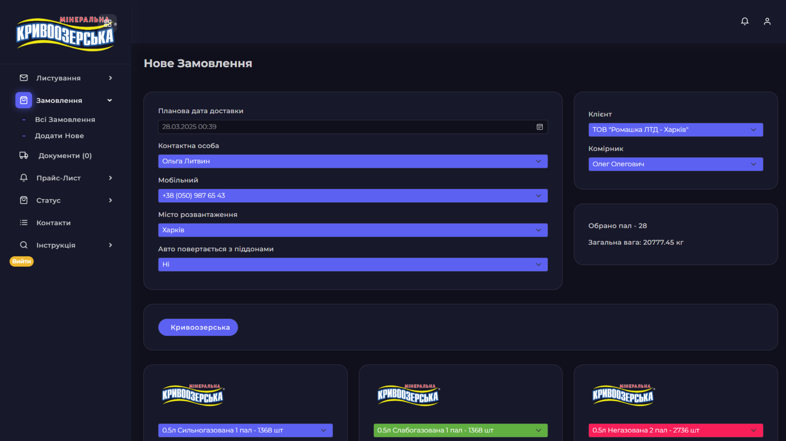  
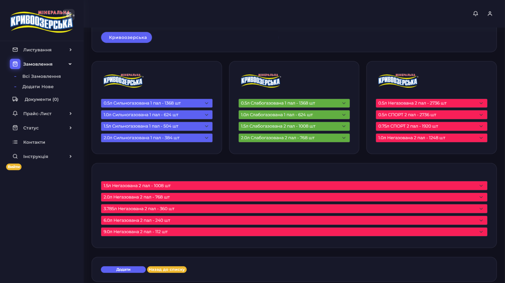  
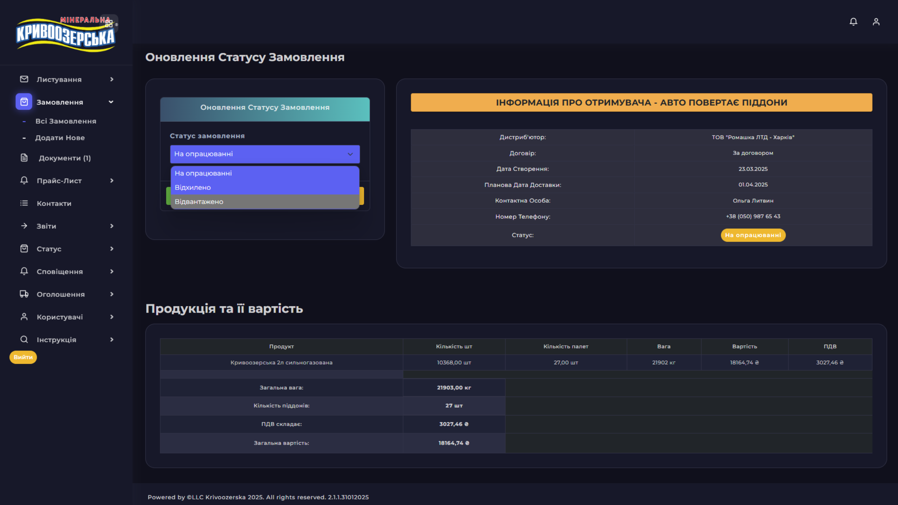  

---

### 3. Documents

This section allows the manufacturer to upload PDF documents for approval by the distributor.
- Upload up to 4 PDF files (only `.pdf` format allowed)  
- Automatic QR code generation upon creation/approval  
- Document comments and statuses: `"Pending"`, `"Approved"`, `"Needs Revision"`  
- QR codes generated using **QRCoder**  
- Files are stored on the server  
- Document visibility is filtered by user role (Distributor, Manager, Admin)  
- Full support for comments, editing, and status update logic  

📸 Show screenshots of the "Documents" section

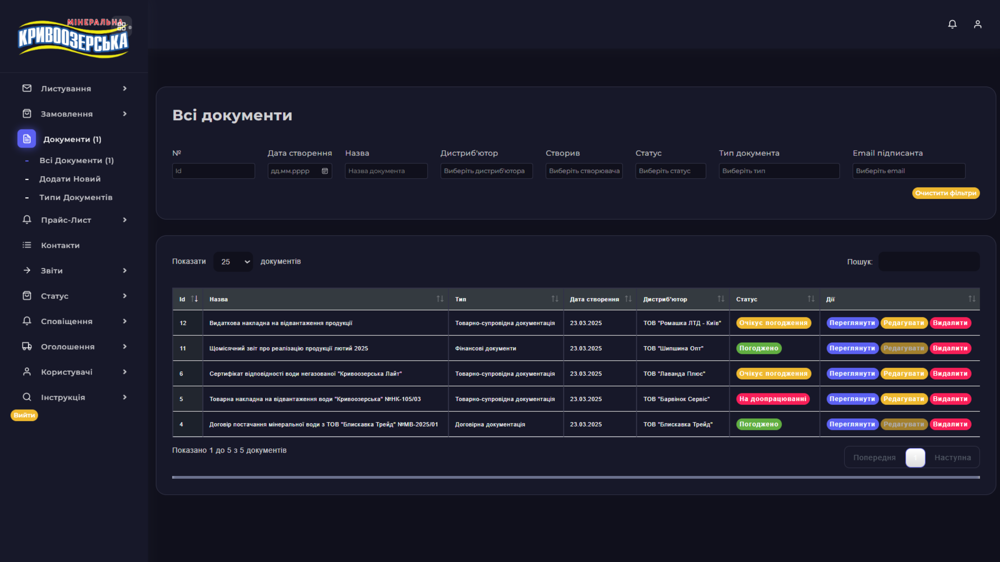  
  
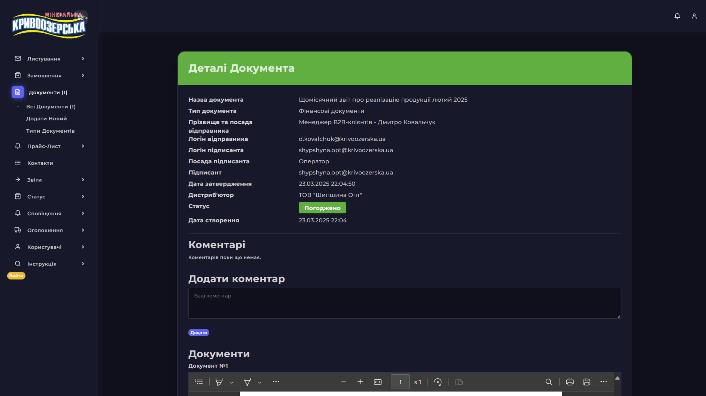  
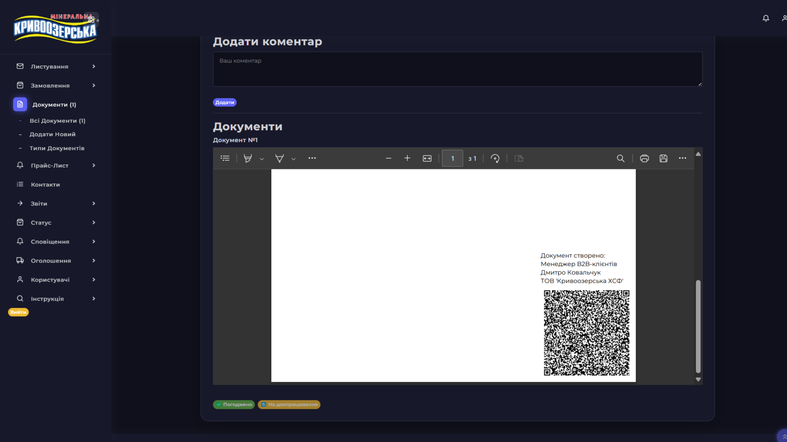  

---

### 4. Price Lists

This section is designed for centralized management of product pricing.  
Each distributor can be assigned an individual price type that is automatically applied in the order form.

- Creation and editing of **individual price lists**
- **Only administrators** can edit price lists
- Price type is assigned during new user registration
- Price lists are stored in **MSSQL** and dynamically loaded into the order form

📸 Show screenshots of the "Price Lists" section

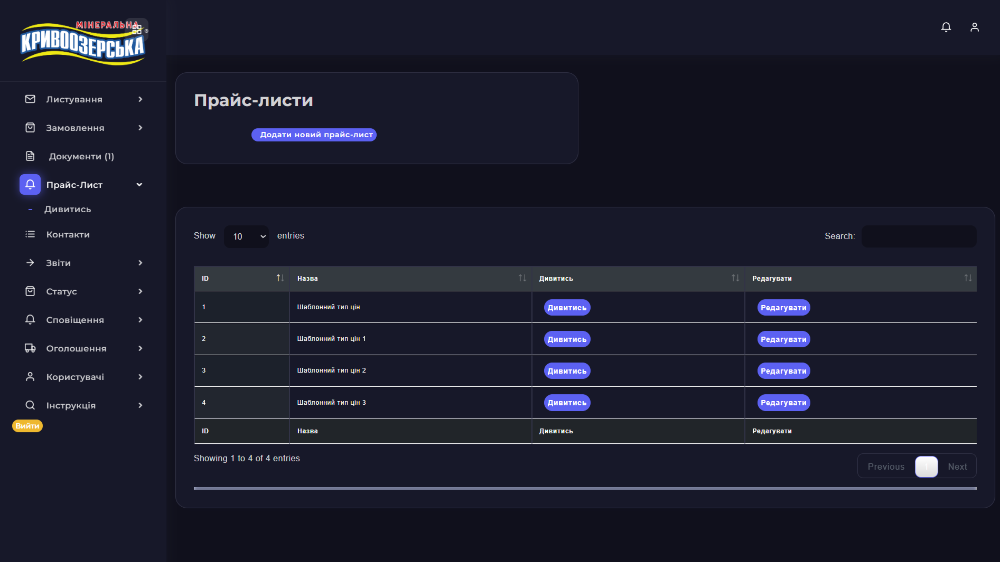  

---

### 5. Contacts

A catalog of manufacturer’s contact persons.  
**Functionality:**  
- Add, edit, and delete contacts **(admin only)**  
- Filter by position  
- Display of phone numbers and email addresses

📸 Show screenshots of the "Contacts" section

  

---

### 6. Reports

- Generate reports **by day** or **by selected period**  
- **Export to `.xlsx`** for further import into the ERP system  
- Automatic filtering and data sorting  

📸 Show screenshots of the "Reports" section

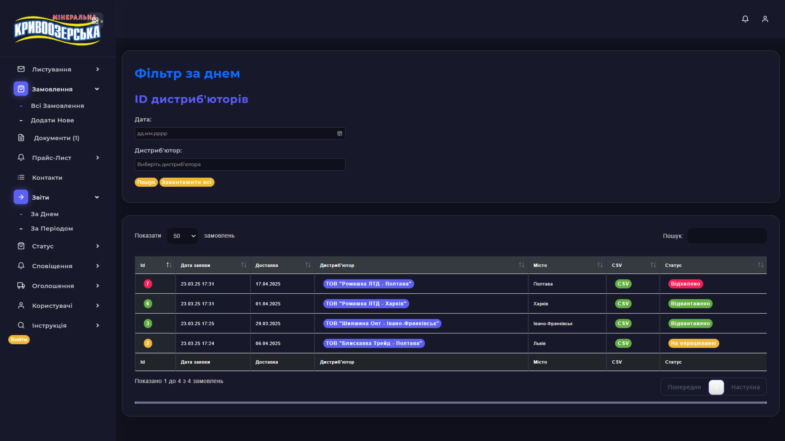  

---

### 7. Order Statuses

- Statuses are set by the **manager** on the manufacturer's side (via the Admin panel).
- After the status is updated, the distributor **receives an email** with the details.
- The table uses **color highlighting** to indicate the status:
  - 🟢 Green — Completed  
  - 🟡 Yellow — In Progress  
  - 🔴 Red — Rejected
- All tables are built using **DataTables** with **live filtering** (search without the "Search" button).

📸 Show screenshots of the "Order Statuses" section

  
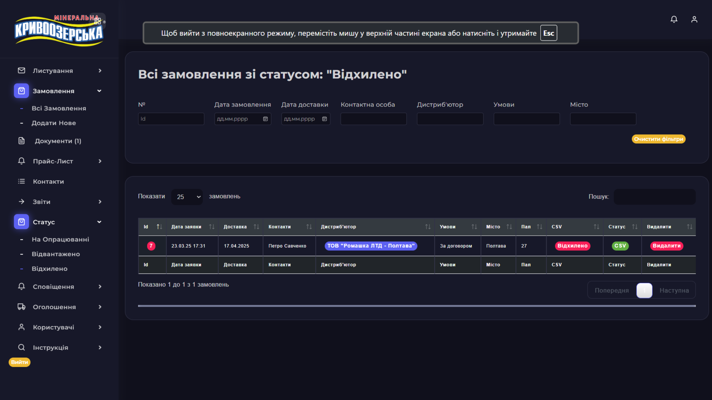

---

### 8. Announcements

- Announcement module for distributors  
- **Functionality includes:**  
  - Image upload  
  - Rich text editor  
  - Publication date scheduling  
  - Ability to enable or disable announcements  

📸 Show screenshots of the "Announcements" section

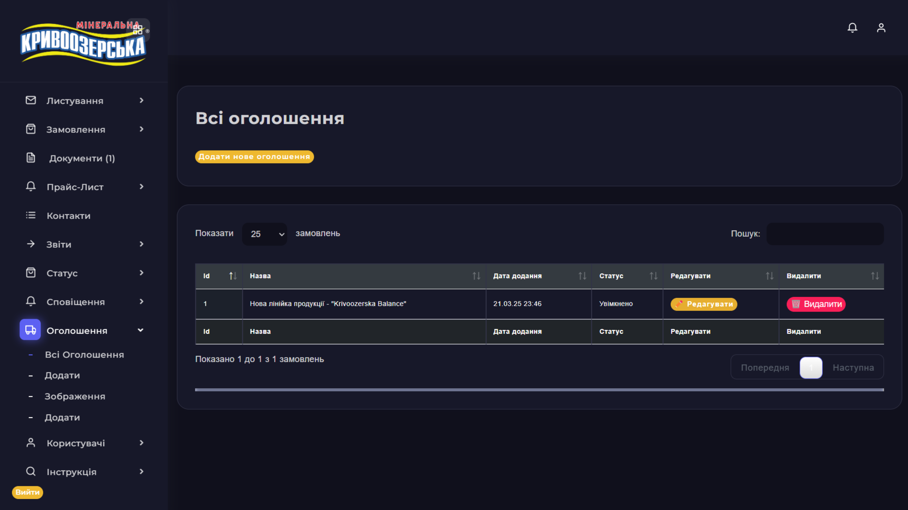  
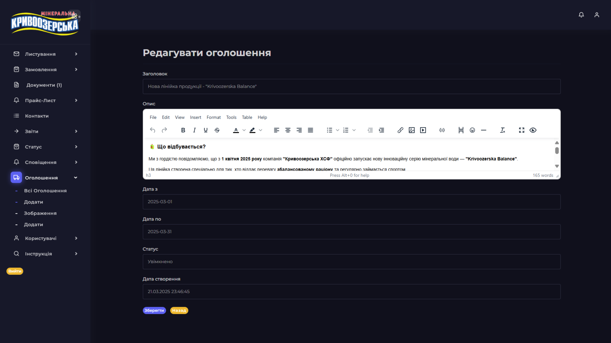  

---

### 9. Users

This section allows administrators to manage user accounts via an authorization system based on **ASP.NET Core Identity** with **EF Core**.

- Registration of new users through a custom form with an extensive list of fields (contacts, cities, signatories, email notifications, etc.)
- Role assignment: **Distributor**, **Manager**, **Administrator**
- Ability to edit detailed user information, including price types, delivery terms, and contract data
- Password changes by administrator using `UserManager`
- All actions are available only in the **Admin panel**
- Access is controlled using `[Authorize(Roles = "...")]`

---

### ✅ Authorization / Roles

- The system is built on **ASP.NET Core Identity** + **IdentityServer4**
- Three main roles are implemented: `Admin`, `Manager`, `Distributor`
- All actions are restricted and controlled via `[Authorize(Roles = "...")]`

---

### ✅ Design – Notes

- All pages are fully **responsive** (mobile, tablet, desktop views)
- The interface is built with **Bootstrap 5** + **custom styles**
- Tables and filters utilize **DataTables** with **real-time filtering support**

---
