---

    
  <strong>Українською</strong>    

    
  <a href="summary_en.md">Switch to English</a>    

  🏠<a href="https://github.com/pohorelov-oleh/portfolio">На головну</a>

---

# 📦 KStore – Кабінет Замовлень Дистриб'ютора

## 📌 Основна інформація
- **Дата введення в експлуатацію:** 02.2024
- **Призначення:** Автоматизація отримання замовлень від дистриб'юторів, листування, контроль статусів замовлень, погодження документів та звітність.
### ⚙️ Стек технологій  
**Бекенд:** ASP.NET Core 6, Entity Framework Core 6, Microsoft SQL Server, Microsoft Graph API  
**Фронтенд:** HTML / CSS / JavaScript, DataTables, TinyMCE, Bootstrap

---

## 🚀 Огляд проєкту

До впровадження **KStore**, на ручне опрацювання замовлень в ERP-системі щотижня витрачалося в середньому **8 годин**, що у річному вимірі становило понад **300 годин** роботи менеджера.  
Після запуску системи цей час скоротився до **менше 10 хвилин на день** – що становить **економію понад 96% часу**.

Раніше процес збору та обробки замовлень у ТОВ «Кривоозерська ХСФ» був неефективним і затратним.  
Замовлення надходили у вигляді окремих файлів через електронну пошту, після чого менеджер вручну вносив їх у ERP-систему: підбирали контрагента, номенклатуру, договір, склад, тару та інші реквізити.  
Через складність процесу та відсутність інтеграції виникали затримки, втрати замовлень, помилки при введенні, а також труднощі, пов’язані з обмеженим доступом до Інтернету у внутрішній мережі підприємства.

Запуск **KStore** вирішив ці проблеми:
- 📥 Дистриб'ютори можуть самостійно створювати замовлення та контролювати попередні  
- 🧾 Усі замовлення вивантажуються у форматі `.csv` для подальшого імпорту в ERP-систему  
- 🔄 Зменшено час на обробку на 98%, усунуто людський фактор та втрати даних  
- 📬 Реалізовано сповіщення та контроль статусів замовлень  
- 🌐 Створено зручний цифровий простір для взаємодії з виробником  
- **KStore** став важливим кроком до цифровізації бізнес-процесів, покращення сервісу для партнерів та зниження операційних витрат.

---

## 📌 Основні функціональні розділи

### 1. Листування
- Внутрішня система обміну повідомленнями між дистриб'юторами та виробником  
- **Функціонал:**  
  - Тема листа, важливість, вкладення  
  - Розширений текстовий редактор **TinyMCE**  
  - Фільтри: `"Отримані"`, `"Надіслані"`, `"Новий лист"`

📸 Показати скріншоти розділу "Листування"

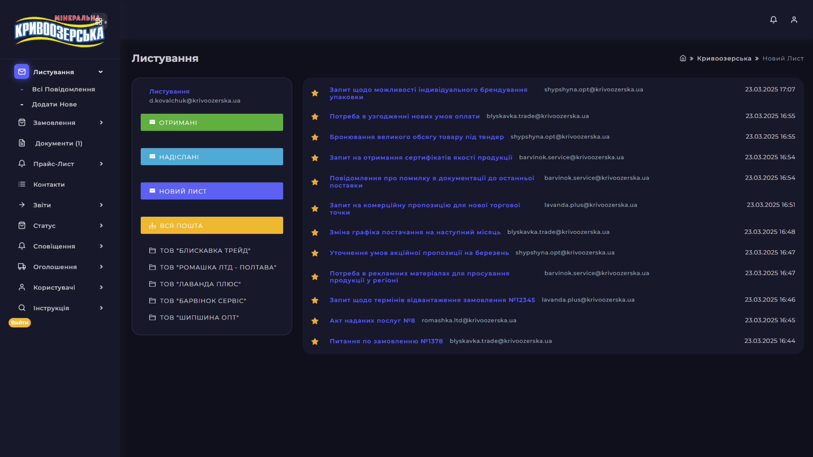  
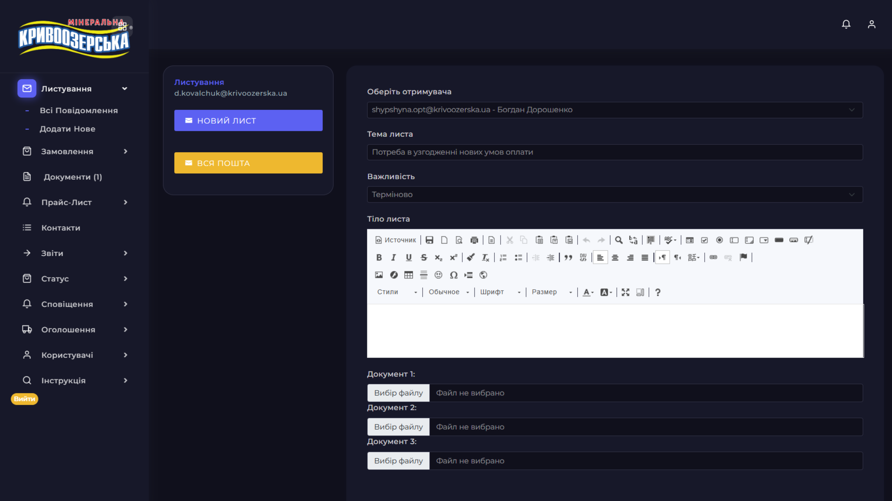
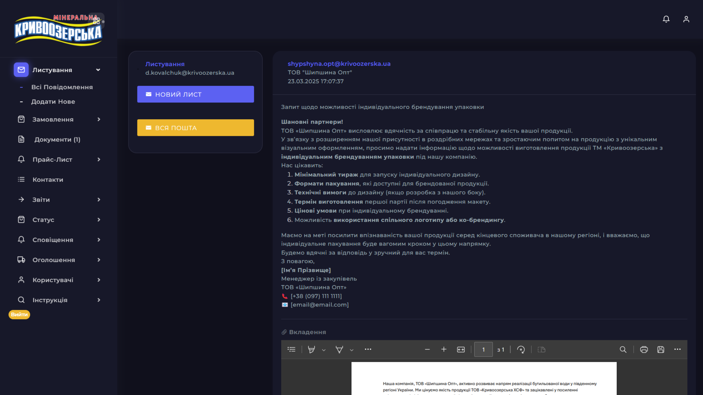

---

### 2. Замовлення
- Відображення та управління всіма замовленнями  
- **Фільтри:** номер замовлення, дата, дистриб'ютор, місто, статус  
- **Статуси:** `"Виконано"`, `"Відхилено"`, `"В процесі виконання"`  
- **Автоматичне сповіщення** через **Microsoft Graph API**  
- **Калькулятор ваги** та піддонів для контролю максимального завантаження  

- Збереження замовлень реалізовано через **Entity Framework Core**, із динамічною валідацією допустимої ваги (до **22 тонн**).
- Кожне замовлення обробляється як **окрема фура**, з розрахунком кількості піддонів і літражу.
- Після створення замовлення, **сповіщення надсилається** відповідальним менеджерам через інтеграцію з **Microsoft Graph API**.
- Замовлення можна **вивантажити у .csv** одним кліком — або кожне окремо, або групою.

- Вивантаження реалізовано через **CsvHelper**.
- Є два режими:
  - Одне замовлення = один `.csv`
  - Група замовлень = один `.csv`-файл
- Формат відповідає вимогам до імпорту в **ERP-систему**: номери позицій, клієнт, номенклатура, дата доставки, місто тощо.

📸 Показати скріншоти розділу "Замовлення"

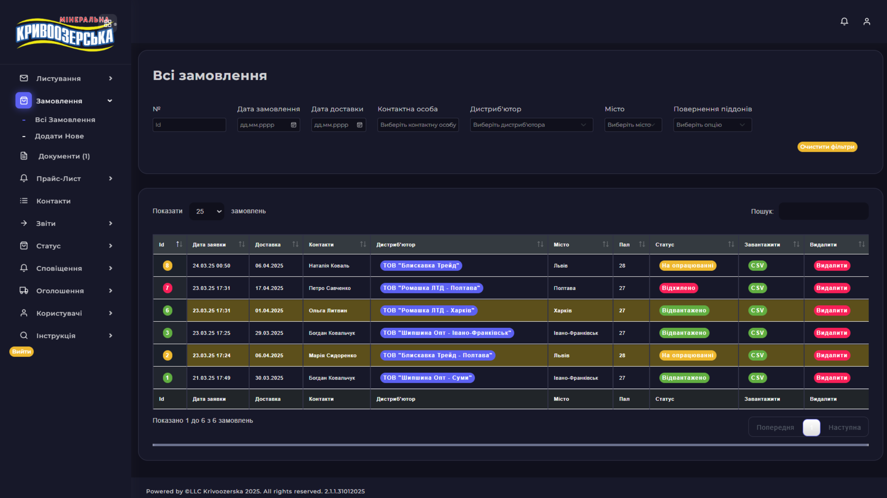  
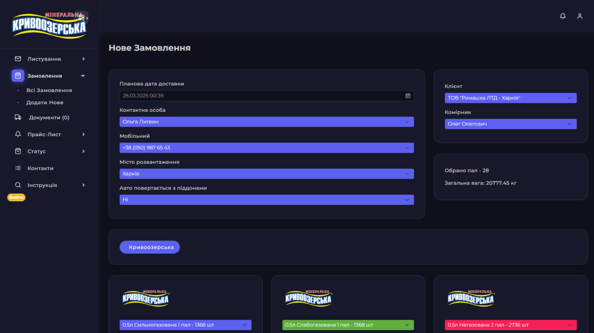
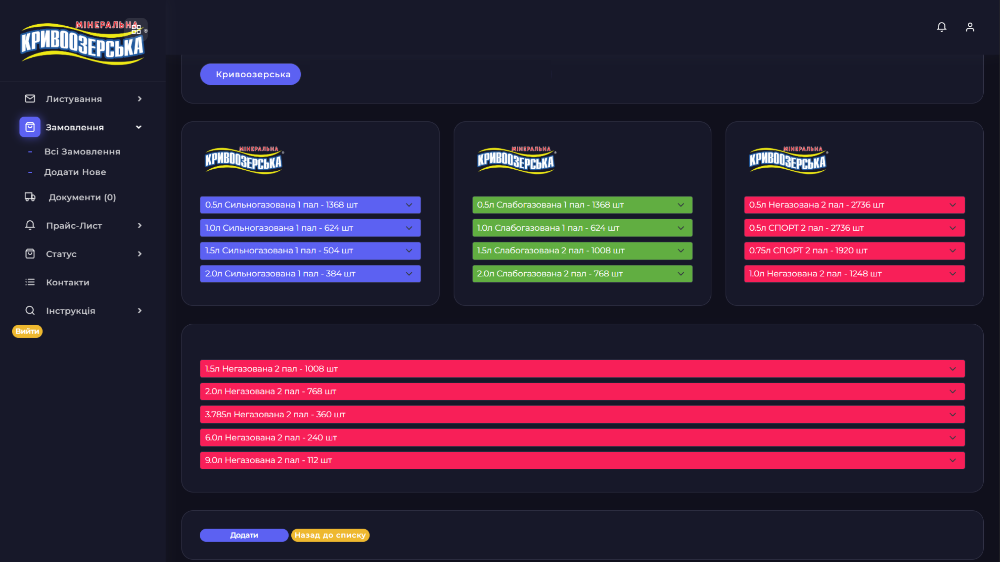
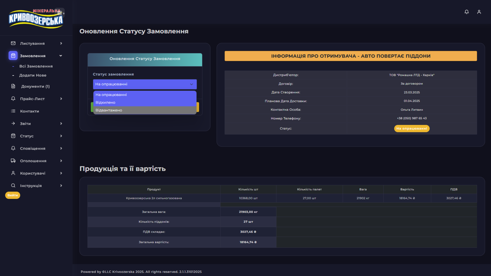
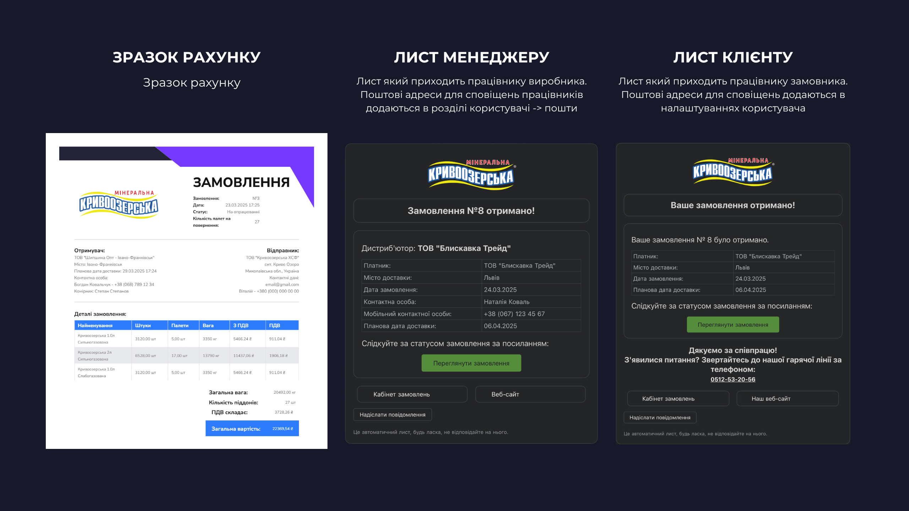

---

### 3. Документи

Розділ дозволяє виробнику завантажувати PDF-документи для погодження з дистриб'ютором.
- Завантаження до 4 PDF-файлів (тільки `.pdf`)
- Автоматичне нанесення QR-коду при створенні/погодженні
- Коментарі до документа, статуси: "Очікує", "Погоджено", "На доопрацюванні"
- Генерація QR через **QRCoder**
- Збереження файлів на сервері
- Документи фільтруються за роллю користувача (Distributor, Manager, Admin)
- Підтримка коментарів, логіки редагування та оновлення статусів

📸 Показати скріншоти розділу "Документи"

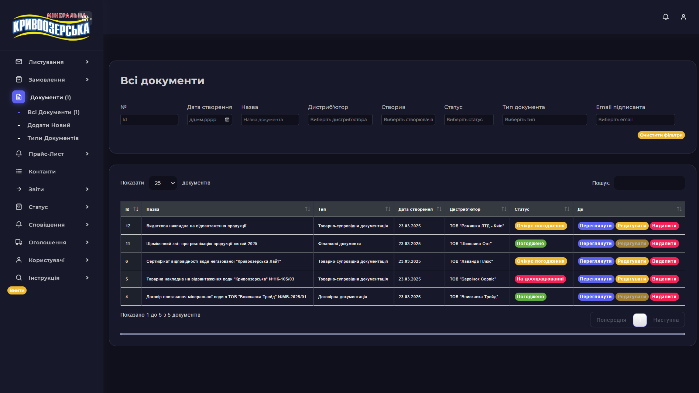  
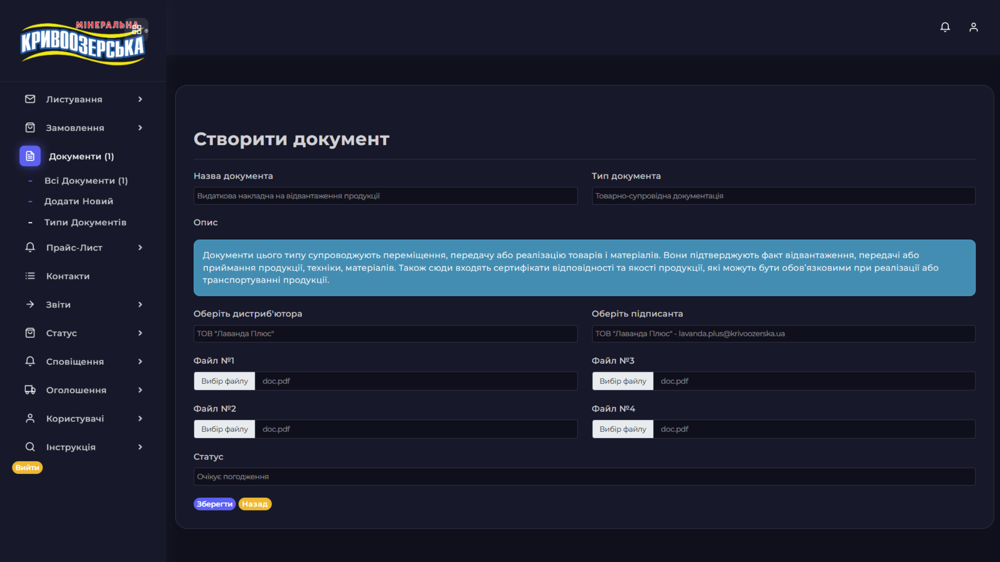
  
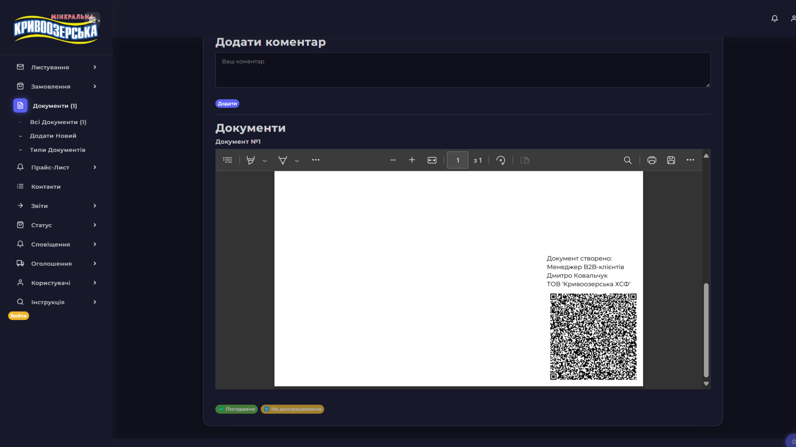

---

### 4. Прайс-листи

Розділ призначений для централізованого управління цінами на продукцію.  
Кожному дистриб’ютору може бути призначений індивідуальний тип цін, який автоматично застосовується у формі замовлення.

- Створення та редагування **індивідуальних прайс-листів**
- **Редагування доступне лише адміністратору**
- Призначення типу ціни під час реєстрації нового користувача
- Прайс-листи зберігаються у **MSSQL** та динамічно підтягуються в форму замовлення

📸 Показати скріншоти розділу "Прайс-листи"

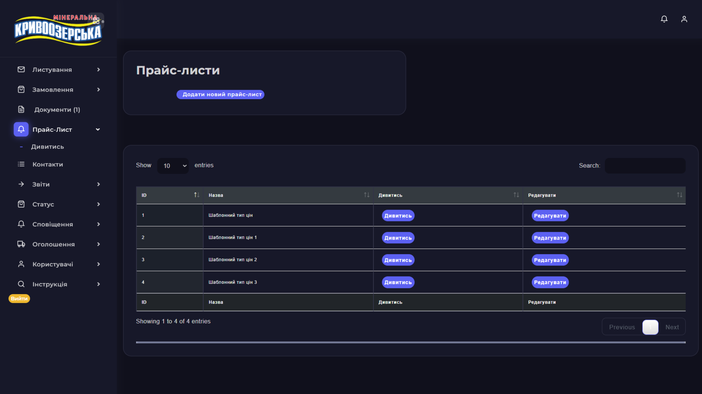  

---

### 5. Контакти
- Каталог контактних осіб виробника  
- **Функціонал:**  
  - Додавання, редагування та видалення контактів **(тільки адміністратор)**  
  - Фільтрація за посадою  
  - Відображення номерів телефонів та email

📸 Показати скріншоти розділу "Контакти"

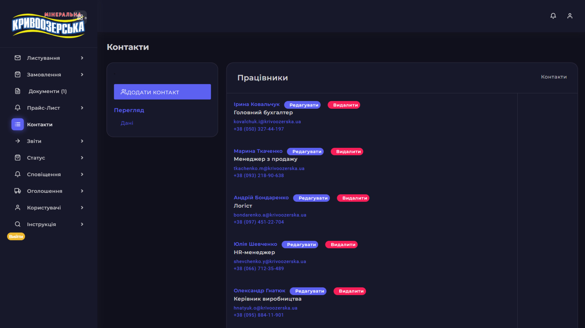  

---

### 6. Звіти
- Формування звітів **за день** або **за період**  
- **Експорт у `.xlsx`** для подальшого імпорту в ERP-систему  
- Автоматична фільтрація та сортування даних  

📸 Показати скріншоти розділу "Звіти"

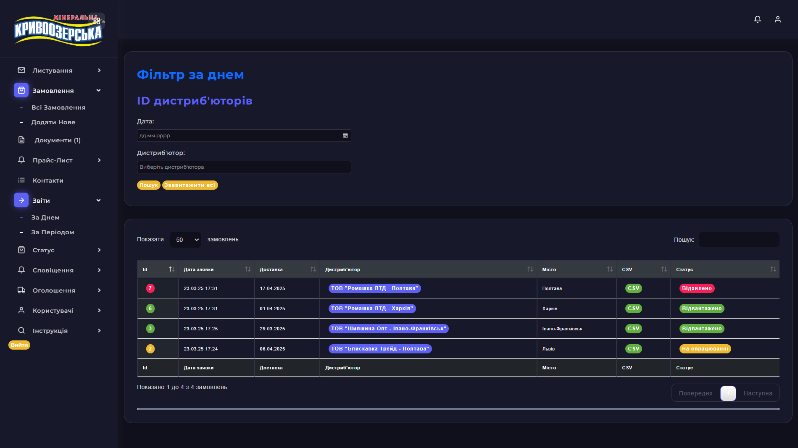  
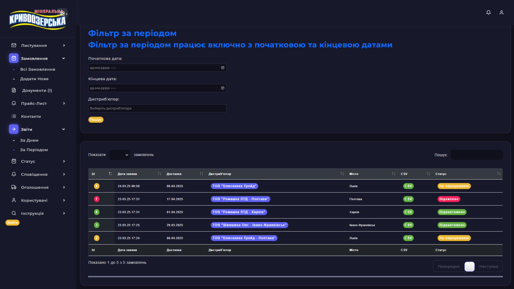

---

### 7. Статуси замовлень

- Статуси задаються **менеджером** на стороні виробника (через Admin-панель).
- Після зміни статусу, дистриб’ютору **надходить email** із деталями.
- У таблиці використано **колірне підсвічування**:
  - 🟢 Зелений — виконано  
  - 🟡 Жовтий — в обробці  
  - 🔴 Червоний — відхилено
- Всі таблиці побудовані на **DataTables** з **live-фільтрами** (пошук без кнопки "Знайти").

📸 Показати скріншоти розділу "Статуси замовлень"

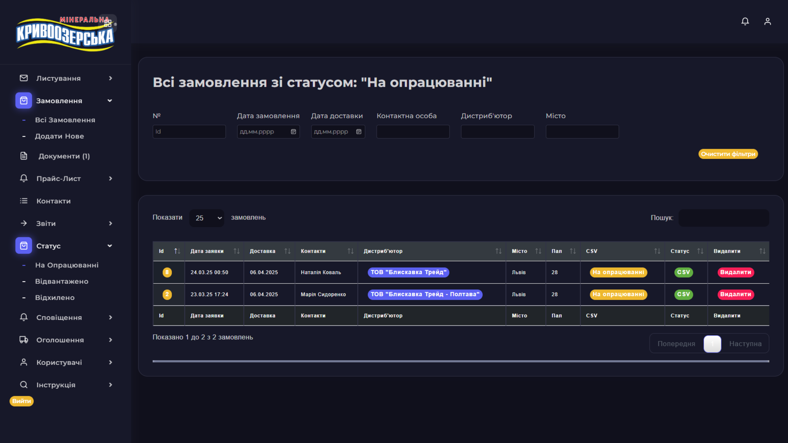  
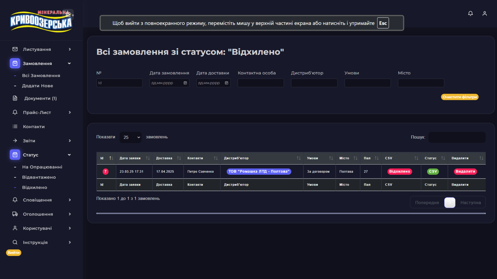

---

### 8. Оголошення
- Модуль оголошень для дистриб'юторів  
- **Функціонал:**  
  - Додавання зображень  
  - Текстовий редактор  
  - Дати публікації  
  - Можливість вмикати та вимикати оголошення  

📸 Показати скріншоти розділу "Оголошення"

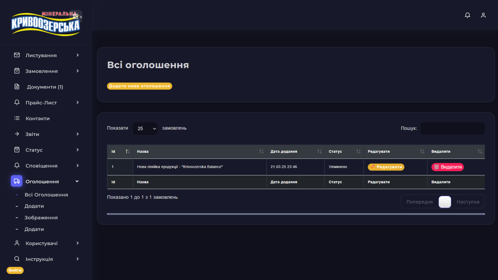  
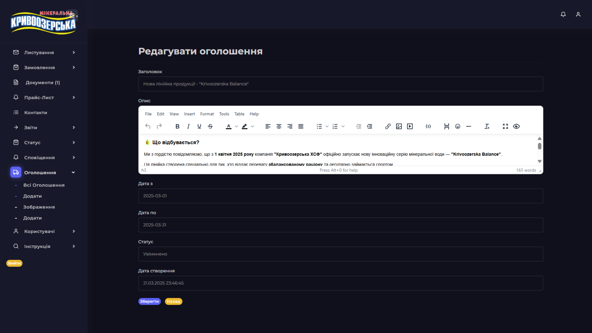  

---

### 9. Користувачі

Розділ дозволяє адміністраторам керувати обліковими записами через систему авторизації на базі **ASP.NET Core Identity** з **EF Core**.

- Реєстрація нових користувачів через кастомну форму з великою кількістю параметрів (контакти, міста, підписанти, email-сповіщення, тощо)
- Призначення ролей: **Distributor**, **Manager**, **Administrator**
- Можливість редагування детальної інформації про користувача, включаючи типи цін, умови доставки, договірні дані
- Зміна пароля адміністратором через `UserManager`
- Всі дії доступні тільки в **Admin-панелі**
- Ролі та права доступу контролюються через `[Authorize(Roles = "...")]`

---

### ✅ Авторизація / ролі

- Система побудована на **ASP.NET Core Identity** + **IdentityServer4**.
- Реалізовано **3 основні ролі**: `Admin`, `Manager`, `Distributor`.
- Усі дії розмежовані через `[Authorize(Roles = "...")]`.

---

### ✅ Дизайн — доповнення

- Усі сторінки мають **адаптивну верстку** (мобільна, планшетна, десктопна версії).
- Інтерфейс побудований на **Bootstrap 5** + **кастомні стилі**.
- Таблиці та фільтри використовують **DataTables** із підтримкою **фільтрації в реальному часі**.

---
