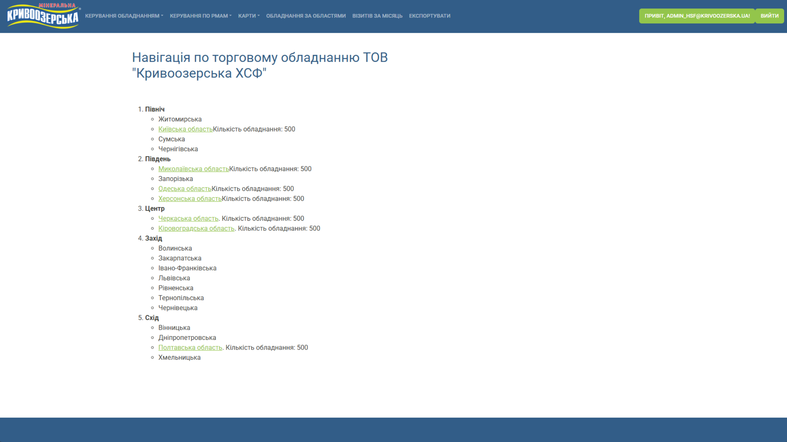
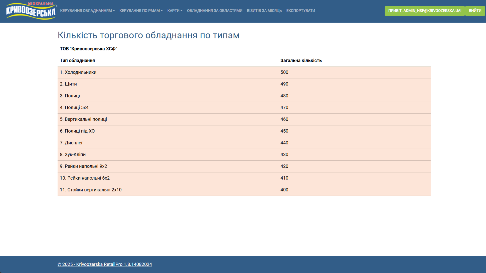
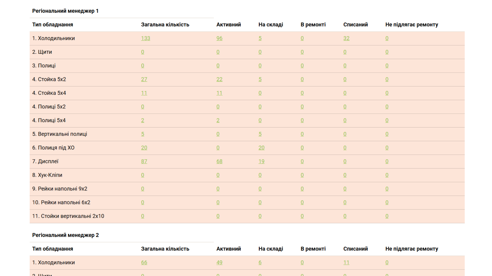
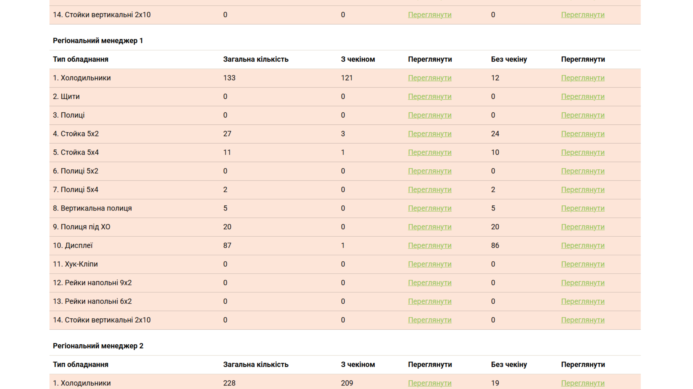
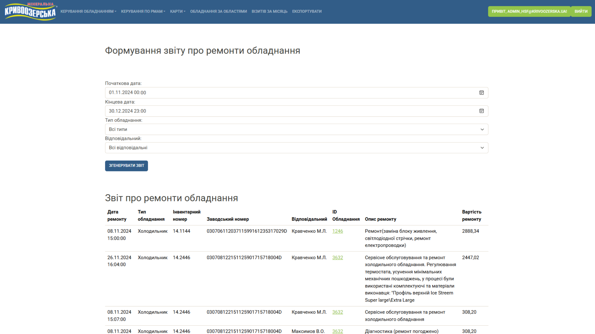
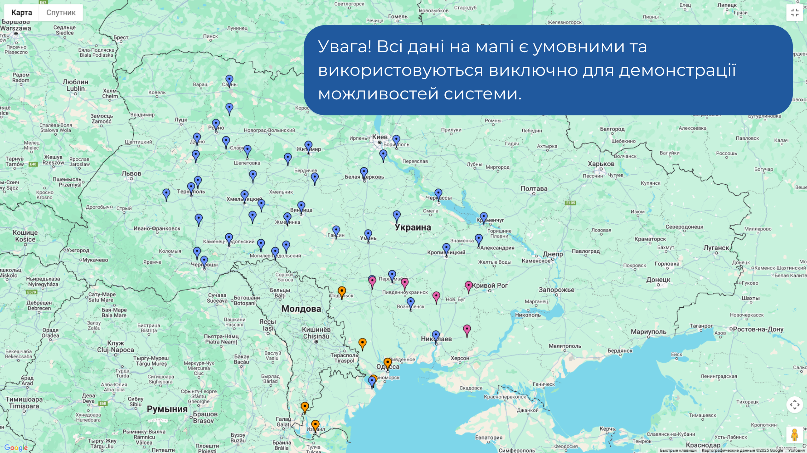
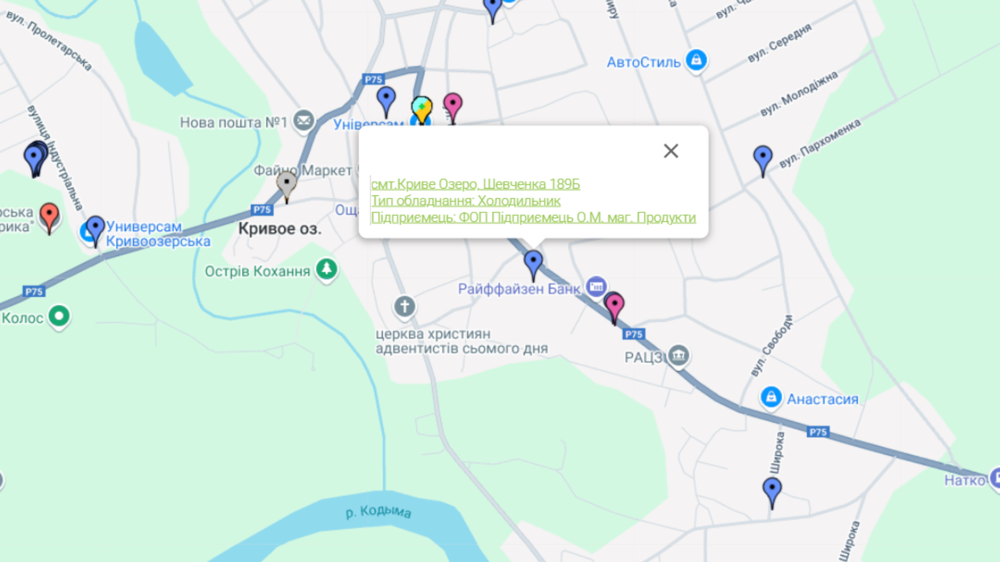

---

    
  <a href="summary_ua.md">Українською</a>

     
    <strong>Switch to English</strong>

  🏠<a href="https://github.com/pohorelov-oleh/portfolio">Main page</a>

---

# 📦 KRetailPro – Trade Equipment Inventory System for LLC "Kryvoozerska KhSF"

📍 **Commissioning Date:** 06.2023  
📍 **Technology Stack:** ASP.NET Core, Microsoft SQL Server, Entity Framework Core, Google Maps API, Microsoft Graph API, Zxing.Net  
📍 **Purpose:** Automation of trade equipment accounting, movement control, analytics, and equipment display on the map.  

---

## 🚀 Project Overview

Before the implementation of **KRetailPro**, the accounting of trade equipment was carried out in **Excel spreadsheets**, which led to data loss, lack of movement control, and inefficient operation.  
**KRetailPro** allows for tracking **refrigerators, shelves, stands**, monitoring their location, viewing analytics, automating the inventory process, and integrating QR codes for quick search.

### 📌 Key Features:
✅ **Navigation by regions, districts, and communities**  
✅ **Visualization on the map via Google Maps API**  
✅ **Real-time search and filtering**  
✅ **QR code scanning for quick equipment search**  
✅ **Automated reports by status, type, photo, distributors**  
✅ **Data export to .xlsx**  
✅ **Movement control and change history**  

---

## 🎯 Main System Features

### 📝 1. Requests  
This section allows you to **manage equipment**:
- Create, edit, and delete requests  
- Track changes and record responsible persons  

📸 Show screenshots of the "Requests" section

  
  

  

---

### 📌 2. Equipment by Regions  
An **hierarchical structure** for viewing equipment is implemented:
- **Regions → Districts → Communities (OTG)**  
- Display of the **number of equipment in each category**  
- Access for **administrators and regional managers**  

📸 Show screenshots of the "Equipment by Regions" section

  
  
  

---
### 📋 3. All Equipment  
This section allows you to **view, add, edit, and delete** equipment.  
Filtering is implemented using **DataTables**, which allows:
- **Dynamic search without page reload**  
- **Sorting by:**  
  - Address, equipment type, sole proprietor, community (OTG), district, distributor  
  - Inventory number  
  - Search by serial number  
- **Edit form**  
- **Export equipment card to .xlsx**  

📸 Show screenshots of the "All Equipment" section

  

---

### 📊 4. Analytics  
Includes **the following reports**:
1. **Equipment quantity by types**  
2. **Distribution by distributors**  
3. **Distribution by status (active, warehouse, under repair, decommissioned)**  
4. **Equipment with photos / without photos**  
5. **Check-in presence (location marker)**  

📸 Show screenshots of the "Analytics" section

  
  
  
  
  

---

### 🔄 5. Equipment Movement  
- Recording the **movement history**  
- Change control by responsible persons  
- **Report export to .xlsx**  

📸 Show screenshots of the "Equipment Movement" section

  

  

---

### 🔧 6. Equipment Repair  
- Maintaining the **repair history**  
- Storing **repair cost and description**  
- Uploading **acts and documents**  
- Filtering by **dates, responsible person, equipment type**  

📸 Show screenshots of the "Equipment Repair" section

  

  

### 📲 7. QR Coding  
**Automatic QR code scanning** for equipment search has been implemented.  
📌 **Library:** **Zxing.Net**  

- **QR codes (10×10 cm) contain the inventory number**  
- **Scanning via mobile device**  
- **Automatic redirect to the equipment card**  

---

### 🗺 8. Equipment Map  
**Google Maps API** is used for visualization:
- **Displaying equipment by types (different marker colors)**  
- **Displaying equipment of a specific manager**  
- **Real-time geolocation**  

📸 Show screenshots of the "Equipment Map" section

  
  

  

---

### 📌 9. Manager Visits  
- **Recording the manager’s presence at the location**  
- **Automatic update of the visit status**  
- **Geolocation and photo capturing**  

📸 Show screenshots of the "Manager Visits" section

  

---

### 📂 10. Export to .xlsx  
**Export of all data** to Excel format is implemented:
- **Equipment by regional managers**  
- **Analytics results**  
- **Repairs and movements**  

---

## 🎯 Implementation Results  
✅ **Transparency of accounting** – equipment is no longer lost between regional managers.  
✅ **Automation** – reduced time spent on inventory management.  
✅ **Mobility** – access to the system from any device.  
✅ **Geolocation** – equipment is visible on the map.  

---
