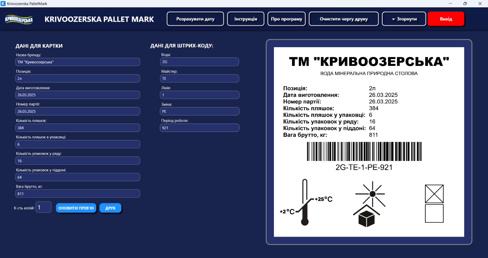

---

    
  <a href="summary_ua.md">Українською</a>

     
    <strong>Switch to English</strong>

  🏠<a href="https://github.com/pohorelov-oleh/portfolio">Main page</a>

---

# Krivoozerska Pallet Mark

**Krivoozerska Pallet Mark** is a desktop application built with **WPF (.NET 9)**, developed for automating the labeling of pallets with mineral water before their transportation to distributors.

## Problem Statement
Previously, product information (name, date, batch number, responsible master, etc.) was written manually on paper sheets, which were placed inside the pallets. This approach had several drawbacks:

- Possibility of human error during filling out;
- Loss or damage of paper labels during transportation;
- Lack of quick identification and data verification.

## Solution Description
**Krivoozerska Pallet Mark** allows users to enter the necessary data into an electronic form, after which the information is printed as a label on a **Xprinter XP-480B** thermal printer. In addition, a **barcode** is generated that contains additional parameters for automated identification.

---

📸 Show application screenshots

  

---

## Functionality

### ✅ Data Entry
The user enters the necessary information, which is divided into two categories:

#### 1. Data printed on the label:
- **Brand Name**
- **Position**
- **Manufacturing Date**
- **Batch Number**
- **Number of Bottles**
- **Bottles per Pack**
- **Packs per Row**
- **Packs per Pallet**
- **Gross Weight, kg**

#### 2. Data for barcode generation:
- **Water**
- **Master**
- **Line**
- **Shift**
- **Work Period**

### ✅ Print Preview
Before printing, the user can preview the generated label on the screen.

### ✅ Barcode Generation
The application generates a unique **barcode** based on the entered data, allowing easy identification of the pallet.

### ✅ Printing with Xprinter XP-480B
The final label is printed on **adhesive tape**, which is applied to the pallet.

### ✅ Multiple Copy Printing
The user can specify the number of copies before printing.

---

## Used Technologies and Libraries

🔹 **.NET 9 and WPF**  
The application is built on **.NET 9** using **Windows Presentation Foundation (WPF)** for developing the user interface.

🔹 **Project Structure**  
The application uses **MVVM (Model-View-ViewModel)** to separate business logic from the UI.

🔹 **Image Generation for Printing**  
**SkiaSharp** is used to generate PNG label images containing all required information.

🔹 **Barcode Generation**  
The **BarcodeStandard** library is used to generate **barcodes** in the Code128 format.

🔹 **Label Printing**  
Printing is implemented using **System.Drawing.Printing**:
- `PrintDocument` — prints the label using the **Xprinter XP-480B** thermal printer.
- `PrinterResolution` — sets high print resolution.
- `PaperSize` — defines the printed label's size.

🔹 **Asynchronous Processing**  
Use of **async/await** prevents UI freezing during:
- Label preview generation.
- Image processing.
- Printing tasks.

🔹 **Resource and File Management**  
- `GC.Collect()` is called before updating images to avoid file locking issues.
- File accessibility is checked before printing.

🔹 **Caching and Print History**  
- Printed labels are archived in a local folder.  
- Recent labels can be viewed later.

---
