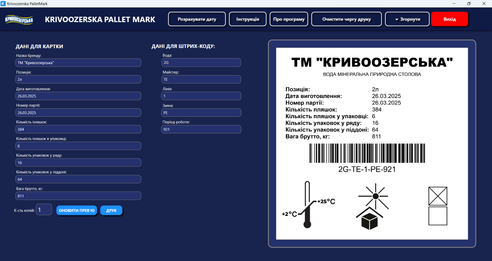
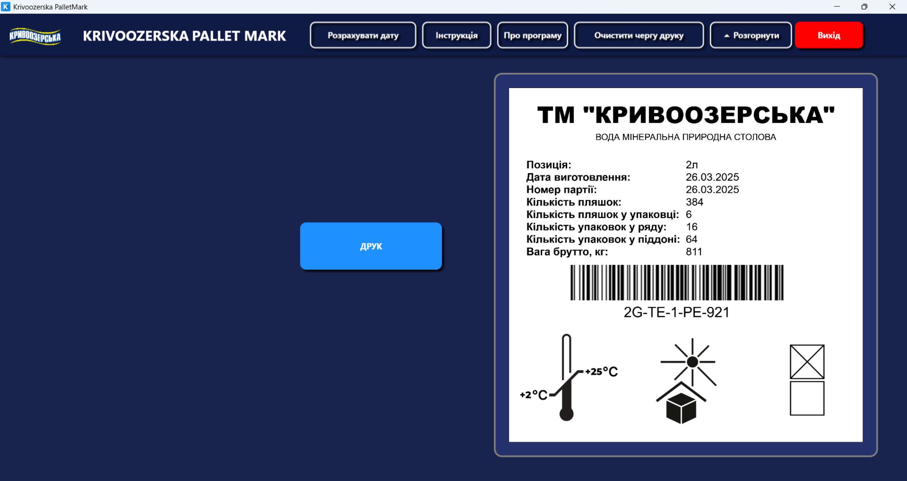

---

    
  <strong>Українською</strong>    

    
  <a href="summary_en.md">Switch to English</a>    

  🏠<a href="https://github.com/pohorelov-oleh/portfolio">На головну</a>

---

# Krivoozerska Pallet Mark

**Krivoozerska Pallet Mark** — це десктопний додаток на **WPF (.NET 9)**, розроблений для автоматизації маркування піддонів із мінеральною водою перед їх транспортуванням до дистриб’юторів.

## Проблематика
Раніше інформація про продукцію (назва, дата, партія, відповідальний майстер тощо) записувалася вручну на паперових листках, які вкладалися в піддони. Такий підхід мав низку недоліків:

- Можливість людських помилок при заповненні;
- Втрата або пошкодження паперових міток під час транспортування;
- Відсутність швидкої ідентифікації та перевірки даних.

## Опис рішення
**Krivoozerska Pallet Mark** дозволяє користувачам вводити необхідні дані в електронну форму, після чого інформація друкується у вигляді етикетки на термопринтері **Xprinter XP-480B**. Крім того, генерується **штрих-код**, що містить додаткові параметри для автоматизованої ідентифікації.

---

📸 Показати скріншоти роботи додатку

  

---

## Функціонал
### ✅ Заповнення даних
Користувач вводить необхідну інформацію, яка поділяється на дві категорії:

#### 1. Дані, що наносяться на етикетку:
- **Назва бренду**
- **Позиція**
- **Дата виготовлення**
- **Номер партії**
- **Кількість пляшок**
- **Кількість пляшок в упаковці**
- **Кількість упаковок у ряду**
- **Кількість упаковок у піддоні**
- **Вага брутто, кг**

#### 2. Дані для генерації штрих-коду:
- **Вода**
- **Майстер**
- **Лінія**
- **Зміна**
- **Період роботи**

### ✅ Прев’ю перед друком
Перед відправкою на друк користувач може переглянути згенеровану етикетку на екрані.

### ✅ Генерація штрих-коду
Додаток створює унікальний **штрих-код** на основі введених даних, що дозволяє легко ідентифікувати піддон.

### ✅ Друк на термопринтері Xprinter XP-480B
Готова етикетка друкується на **клейкій стрічці**, яка наклеюється на піддон.

### ✅ Можливість друку декількох копій
Користувач може задати кількість копій перед друком.

---

## Використані технології та бібліотеки

🔹 .NET 9 та WPF
Додаток побудований на **.NET 9** з використанням **Windows Presentation Foundation (WPF)** для розробки користувацького інтерфейсу.

🔹 Структура проєкту
Додаток використовує **MVVM (Model-View-ViewModel)** для розділення логіки бізнес-процесів та інтерфейсу.

🔹 Генерація зображень для друку
Використано **SkiaSharp** для створення зображень етикеток у форматі PNG, що містять всю необхідну інформацію.

🔹 Генерація штрих-коду
Застосовується бібліотека **BarcodeStandard** для генерації **штрих-кодів** у форматі Code128.

🔹 Друк етикеток
Для друку використовується **System.Drawing.Printing**:
- `PrintDocument` — друк етикетки на термопринтері **Xprinter XP-480B**.
- `PrinterResolution` — налаштування високої роздільної здатності друку.
- `PaperSize` — встановлення розміру друкованої етикетки.

 🔹 Асинхронна робота
Застосування **async/await** дозволяє уникнути блокування головного потоку під час:
- Генерації прев’ю етикетки.
- Обробки зображень.
- Виконання друку.

 🔹 Обробка ресурсів та файлів
- Використовується `GC.Collect()` перед оновленням зображень, щоб уникнути блокування файлів.
- Перевіряється доступність файлів перед друком.

 🔹 Кешування та збереження історії друку
- Архівування надрукованих етикеток у локальній папці.
- Можливість перегляду останніх етикеток.

---
